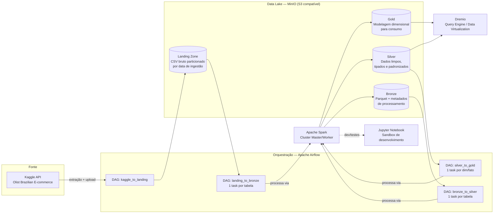

# Data Lakehouse — Olist E-commerce

Pipeline de dados end-to-end, containerizado, que simula um ambiente real de Engenharia de Dados: ingestão de um dataset público de e-commerce, orquestração via Airflow, processamento distribuído com Spark e organização em arquitetura Medalhão (Landing → Bronze → Silver → Gold) sobre um data lake S3-compatible.

O objetivo do projeto é praticar e demonstrar, com uma stack próxima da usada no mercado, todo o ciclo de vida do dado: extração, orquestração, processamento, versionamento em camadas e disponibilização para consumo analítico.


> ⚠️ **Projeto em desenvolvimento ativo.** Este é um projeto de portfólio e a seção [Status &amp; Roadmap](#status--roadmap) documenta com transparência o que já está funcionando e o que ainda está em construção.

---

## Sumário

- [Arquitetura](#arquitetura)
- [Stack utilizada](#stack-utilizada)
- [Sobre os dados](#sobre-os-dados)
- [Estrutura do repositório](#estrutura-do-repositório)
- [Como rodar o projeto](#como-rodar-o-projeto)
- [Documentação](#documentação)
- [Status &amp; Roadmap](#status--roadmap)
- [Decisões técnicas](#decisões-técnicas)
- [Autor](#autor)

---

## Arquitetura

O projeto segue a **arquitetura Medalhão (Medallion Architecture)**, um padrão amplamente adotado em Lakehouses para garantir rastreabilidade e qualidade incremental dos dados a cada camada.



**Fluxo resumido:**

1. **Extração** — uma DAG do Airflow baixa o dataset [Olist Brazilian E-commerce](https://www.kaggle.com/datasets/olistbr/brazilian-ecommerce) via API do Kaggle e envia os CSVs para a **Landing Zone** no MinIO, particionados por data de ingestão (`ingestion_date=YYYY-MM-DD`).
2. **Landing → Bronze** — uma DAG genérica gera dinamicamente uma task Spark por tabela (clientes, pedidos, itens, pagamentos, avaliações, produtos, vendedores, geolocalização, categorias) a partir de um registro central de configuração. Cada task lê o CSV bruto e grava em **Parquet** na camada Bronze, preservando o dado original e adicionando apenas metadados técnicos (timestamp de processamento).
3. **Bronze → Silver** — mesma estrutura genérica: um único script Spark aplica a regra de tratamento específica de cada tabela (limpeza, padronização de tipos, trim/normalização de texto), definida em um registro de transformações (`silver_rules.py`), gravando o resultado em Parquet na camada Silver.
4. **Silver → Gold** — mesma estrutura genérica gera as dimensões e fatos do **modelo dimensional (star schema)** a partir de um registro de objetos (`gold_objects.py`) e um registro de regras de construção (`gold_rules.py`). São **4 dimensões** (`dim_cliente`, `dim_produto`, `dim_vendedor`, `dim_tempo`) e **3 fatos de grãos separados** (`fato_pedidos_itens`, `fato_pagamentos`, `fato_avaliacoes`) — a separação evita o *fan-out* (contagem duplicada de receita) que ocorreria ao juntar itens e pagamentos numa tabela só. Responde perguntas como receita por região, ticket médio, prazo/atraso de entrega e impacto do atraso na avaliação.
5. **Consumo** — a camada analítica é exposta via **Dremio**, que atua como motor de consulta SQL sobre o data lake, permitindo consumo direto por ferramentas de BI.
6. **Jupyter** é usado como ambiente de sandbox para prototipar as transformações Spark antes de promovê-las para scripts de produção.

---

## Stack utilizada

| Camada | Ferramenta | Papel no projeto |
|---|---|---|
| Orquestração | **Apache Airflow 2.11** (LocalExecutor) | Agendamento e dependência entre as etapas do pipeline |
| Processamento | **Apache Spark 3.5.1** (cluster standalone Master/Worker) | Transformação distribuída dos dados entre camadas |
| Armazenamento | **MinIO** (S3-compatible) | Data Lake local, organizado em buckets `landing-zone`, `bronze`, `silver`, `gold` |
| Query Engine | **Dremio 26** | Virtualização e consulta SQL federada sobre o Lakehouse |
| Metastore | **PostgreSQL 15** | Backend de metadados do Airflow |
| Fila de tarefas | **Redis** | Broker de mensagens do Airflow (Celery-ready) |
| Desenvolvimento | **Jupyter (PySpark Notebook)** | Sandbox para prototipagem das transformações |
| Infraestrutura | **Docker &amp; Docker Compose** | Orquestração local de todos os serviços acima |

Todos os serviços rodam em containers próprios, comunicando-se por uma rede Docker dedicada (`airflow-network`), com Dockerfiles customizados para Airflow e Spark (JDK 17, JARs de integração S3A/Hadoop-AWS, usuário non-root no Spark).

---

## Sobre os dados

O projeto utiliza o [**Brazilian E-commerce Public Dataset by Olist**](https://www.kaggle.com/datasets/olistbr/brazilian-ecommerce), um conjunto de dados público com ~100 mil pedidos realizados entre 2016 e 2018 em um marketplace brasileiro, contendo informações sobre pedidos, clientes, produtos, vendedores, pagamentos, avaliações e geolocalização — um cenário realista para praticar modelagem analítica de e-commerce.

Os dados brutos **não são versionados neste repositório** (ver `.gitignore`); eles são baixados dinamicamente pela DAG de extração a cada execução.

---

## Estrutura do repositório

```
.
├── infrastructure/
│   ├── docker/
│   │   ├── airflow/           # Dockerfile e requirements do Airflow (+ Spark client, Java 17)
│   │   ├── spark/             # Dockerfile e requirements do cluster Spark
│   │   └── docker-compose.yaml
│   └── kubernetes/            # Reservado para manifests de deploy em K8s (futuro)
├── pipelines/
│   ├── config/               # Registros centrais: tabelas (tabelas_olist.py) e objetos Gold (gold_objects.py)
│   ├── dags/                 # DAGs genéricas: geram 1 task por tabela/objeto a partir da config
│   └── scripts/              # Jobs PySpark genéricos + regras de transformação (silver_rules.py, gold_rules.py)
├── notebooks/
│   ├── bronze/               # Sandbox de prototipagem (Landing → Bronze)
│   ├── silver/               # Sandbox de prototipagem por tabela (Bronze → Silver)
│   └── gold/                 # Sandbox de modelagem (Silver → Gold)
├── docs/                     # Documentação técnica (decisões, desafios, modelo dimensional)
├── lakehouse/                # Bind mount local do MinIO (landing-zone / bronze / silver / gold)
├── utils/                    # Funções utilitárias compartilhadas entre jobs Spark
└── secrets/                  # Credenciais locais não versionadas (ex: kaggle.json)
```

---

## Como rodar o projeto

### Pré-requisitos

- Docker e Docker Compose
- Conta no [Kaggle](https://www.kaggle.com/) com um token de API (`kaggle.json`)

### Passo a passo

```bash
# 1. Clone o repositório
git clone https://github.com/RafaelMaciel2005/Engenharia-de-Dados.git
cd Engenharia-de-Dados

# 2. Configure as variáveis de ambiente
cp infrastructure/docker/.env.example infrastructure/docker/.env
# edite infrastructure/docker/.env e defina, entre outras:
#   PROJECT_ROOT=<caminho absoluto para a raiz deste repositório>
#   AIRFLOW__CORE__FERNET_KEY=<gerar com o comando abaixo>
python -c "from cryptography.fernet import Fernet; print(Fernet.generate_key().decode())"

# 3. Adicione seu token do Kaggle
# baixe em https://www.kaggle.com/settings > API > Create New Token
cp ~/Downloads/kaggle.json secrets/kaggle.json

# 4. Suba todos os serviços
cd infrastructure/docker
docker compose up -d --build
```

### Acessando os serviços

| Serviço | URL | Credenciais |
|---|---|---|
| Airflow | http://localhost:8080 | definidas em `.env` (`_AIRFLOW_WWW_USER_*`) |
| MinIO Console | http://localhost:9001 | definidas em `.env` (`MINIO_ROOT_*`) |
| Spark Master UI | http://localhost:8081 | — |
| Dremio | http://localhost:9047 | configurado no primeiro acesso |
| Jupyter Lab | http://localhost:8888 | token definido em `.env` (`JUPYTER_TOKEN`) |

### Executando o pipeline

No Airflow, dispare as DAGs manualmente na seguinte ordem (ainda não há uma DAG "mestre" — ver [Roadmap](#status--roadmap)):

1. `kaggle_to_landing_zone`
2. `landing_to_bronze` (gera 1 task por tabela automaticamente)
3. `bronze_to_silver` (idem, aplicando as regras de tratamento de cada tabela)
4. `silver_to_gold` (gera 1 task por dimensão/fato do modelo dimensional)

---

## Documentação

Além deste README, a pasta [`docs/`](docs/) reúne a documentação técnica aprofundada — o **porquê** das escolhas e os problemas reais enfrentados no caminho:

| Documento | Conteúdo |
|---|---|
| [Decisões Arquiteturais](docs/decisoes-arquiteturais.md) | Registro (formato ADR) das principais escolhas: arquitetura Medalhão, DAGs genéricas, fatos separados, MinIO/Dremio/Parquet, credenciais, etc. — com contexto e trade-offs de cada uma. |
| [Desafios Técnicos](docs/desafios-tecnicos.md) | Problemas reais e como foram resolvidos: corrupção do Postgres em bind mount no Windows, CSV multilinha do `reviews`, fan-out entre itens e pagamentos, a pegadinha do `customer_unique_id`, e outros. |
| [Modelo Dimensional](docs/modelo-dimensional.md) | Documentação do star schema da camada Gold: grão de cada fato, dimensões, linhagem e queries de negócio com **resultados reais** (receita por estado, impacto do atraso na avaliação). |

---

## Status &amp; Roadmap

Transparência sobre o estado atual do projeto — parte importante de mostrar maturidade técnica é deixar claro o que está pronto e o que está em progresso.

### ✅ Concluído

- [x] Ambiente containerizado completo (Airflow, Spark, MinIO, Dremio, Postgres, Redis, Jupyter)
- [x] Ingestão automatizada do Kaggle para a Landing Zone, particionada por data
- [x] Pipeline Landing → Bronze para as 9 entidades do dataset Olist
- [x] Pipeline Bronze → Silver para as 9 entidades, com regras de tratamento específicas por tabela
- [x] DAGs e scripts genéricos: 1 DAG por camada gera as tasks dinamicamente a partir de um registro central de configuração (adicionar tabela nova = 1 linha de config, não um arquivo novo)
- [x] Camada Gold com modelagem dimensional (star schema): 4 dimensões (`dim_cliente`, `dim_produto`, `dim_vendedor`, `dim_tempo`) e 3 fatos de grãos separados (`fato_pedidos_itens`, `fato_pagamentos`, `fato_avaliacoes`) para evitar fan-out entre itens e pagamentos
- [x] Boas práticas de segredo: `.env` e credenciais fora do versionamento, com `.env.example` de referência
- [x] Sem credenciais hardcoded em código: criação da `SparkSession` centralizada em `utils/spark_utils.py`, lida via variáveis de ambiente, usada tanto pelos jobs do Airflow quanto pelo notebook; conexões `spark_default`/`minio_default` definidas via `AIRFLOW_CONN_*` no `.env`

### 🚧 Em andamento

- [ ] DAG mestre orquestrando as camadas com dependências e agendamento reais (hoje cada DAG é disparada manualmente e isoladamente)
- [ ] Testes de qualidade de dados (schema, nulos, duplicidade) integrados ao pipeline

### 📋 Planejado

- [ ] Testes automatizados das transformações Spark (pytest)
- [ ] Pipeline de CI (lint + testes + build das imagens) via GitHub Actions
- [ ] Camada de consumo/BI conectada ao Dremio (Metabase ou Superset)
- [ ] Estratégia de escrita incremental/particionada (hoje as escritas são full overwrite)
- [ ] Deploy em Kubernetes (estrutura já reservada em `infrastructure/kubernetes/`)

---

## Decisões técnicas

- **Por que MinIO e não acessar S3 diretamente?** MinIO reproduz a API do S3 localmente, permitindo desenvolver e testar toda a integração `s3a://` do Spark sem depender de uma conta cloud — o mesmo código de leitura/escrita funcionaria apontando para um bucket S3 real.
- **Por que uma DAG genérica por camada, com uma task por tabela?** O isolamento de falhas fica no nível da task (se `reviews` falhar, as outras 8 tabelas seguem processando), mas sem duplicar código: as tasks são geradas em loop a partir de um registro central de configuração, e a lógica específica de cada tabela vive em um dicionário de funções de transformação (`silver_rules.py`). Adicionar uma tabela nova é uma linha de config + uma função de regra — não um novo par DAG/script copiado.
- **Por que Spark em cluster standalone (Master/Worker) em vez de modo local?** Para reproduzir o comportamento de submissão de jobs (`SparkSubmitOperator`) e paralelismo real entre driver e workers, mais próximo de um ambiente produtivo do que `local[*]`.
- **Por que Parquet em todas as camadas intermediárias?** Formato colunar, comprimido e com schema embutido — leitura mais eficiente que CSV para os jobs Spark subsequentes, e padrão de mercado para data lakes.
- **Por que Dremio na camada de consumo?** Permite consultar os dados do Lakehouse via SQL sem duplicar dados em um data warehouse, e federar múltiplas fontes no futuro.

> 📖 O detalhamento completo dessas e de outras decisões (com contexto e trade-offs) está em [`docs/decisoes-arquiteturais.md`](docs/decisoes-arquiteturais.md).

---

## Autor

**Rafael Maciel**
Projeto pessoal de estudo e portfólio em Engenharia de Dados.

Licenciado sob [MIT License](LICENSE).
